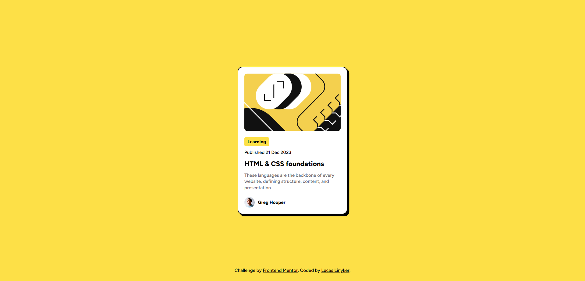

# Frontend Mentor - Solução para o desafio Blog preview card

Esta é uma solução para o [Desafio Blog preview card no Frontend Mentor](https://www.frontendmentor.io/challenges/blog-preview-card-ckPaj01IcS). Os desafios do Frontend Mentor ajudam você a melhorar suas habilidades de codificação, construindo projetos realistas.

## Sumário

- [Visão geral](#visão-geral)
  - [O desafio](#o-desafio)
  - [Captura de tela](#captura-de-tela)
  - [Links](#links)
- [Meu processo](#meu-processo)
  - [Desenvolvido com](#desenvolvido-com)
  - [O que aprendi](#o-que-aprendi)
  - [Desenvolvimento contínuo](#desenvolvimento-contínuo)
  - [Recursos úteis](#recursos-úteis)
- [Autor](#autor)
- [Instalação e execução](#instalação-e-execução)

## Visão Geral

### O desafio

Os usuários devem ser capazes de:

- Ver estados de hover e foco para todos os elementos interativos na página

### Captura de tela



### Links

- URL da solução: [https://github.com/lucaslinyker/blog-preview-card](https://github.com/lucaslinyker/blog-preview-card)
- URL do site ao vivo: [https://lucaslinyker.github.io/blog-preview-card](https://lucaslinyker.github.io/blog-preview-card)

## Meu processo

### Desenvolvido com

- Marcação semântica de HTML5
- Flexbox
- Fluxo de trabalho mobile-first
- [React](https://reactjs.org) - Biblioteca JS
- [Tailwind CSS](https://tailwindcss.com) - Para estilização

### O que aprendi

Criar componentes em React, configurações básicas do Tailwind para classes e organizar classes do Tailwind com ESLint.

### Desenvolvimento contínuo

Continuar aprendendo mais sobre React e Tailwind CSS, assim como configurar o ESLint corretamente para melhorar a produtividade da minha equipe.

Tenho explorado diferentes componentes React, além de aprofundar-me nas classes de utilidade e recursos de design escuro do Tailwind CSS. Tem sido uma jornada emocionante até agora, e estou ansioso para aplicar meu conhecimento recém-adquirido em projetos futuros.

Se você tiver recursos ou dicas sobre React ou Tailwind CSS, sinta-se à vontade para compartilhar comigo!

### Recursos úteis

- [Vídeo sobre hospedagem no GitHub Pages com React](https://www.youtube.com/watch?v=-weTjP3pYxs) - Isso me ajudou a hospedar um aplicativo em React. Eu já entendia como hospedar um site, mas não um site em React.
- [Documentação do Tailwind](https://tailwindcss.com/docs/installation) - Esta é uma documentação incrível do Tailwind que me ajudou a finalmente entender como estilizar com o Tailwind. Eu recomendo para qualquer um que queira aprender este framework.

## Autor

- GitHub - [lucaslinyker](https://github.com/lucaslinyker)
- Frontend Mentor - [@lucaslinyker](https://www.frontendmentor.io/profile/lucaslinyker)
- Instagram - [@lucas_linyker](https://www.instagram.com/lucas_linyker)

## Instalação e execução

```bash
  # Clonar o projeto
  git clone https://github.com/lucaslinyker/blog-preview-card.git
  # Entrar na pasta do projeto
  cd blog-preview-card
  # Instalar as dependências
  npm install
  # Executar o projeto
  npm run dev
```

**OBS: É necessário ter o Node.js instalado na máquina.**

[⬆ Voltar ao topo](#frontend-mentor---solução-para-o-desafio-blog-preview-card)
